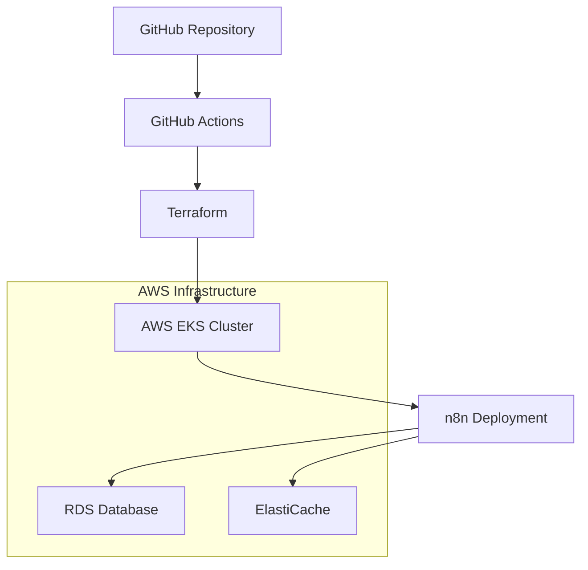

# N8N Infrastructure Deployment

## Overview

This repository contains a production-ready infrastructure-as-code (IaC) solution for deploying n8n workflows on AWS using Terraform and GitHub Actions. The project follows AWS Well-Architected Framework principles, providing a secure, scalable, and maintainable workflow automation platform.

## Architecture



### Key Components
- **Compute**: Amazon EKS (Elastic Kubernetes Service)
- **Database**: Amazon RDS
- **Caching**: Amazon ElastiCache
- **Networking**: VPC with private/public subnets
- **CI/CD**: GitHub Actions with OIDC authentication

## Prerequisites

1. AWS Account
2. GitHub Account
3. Terraform CLI
4. AWS CLI
5. kubectl
6. GitHub CLI (optional)

## Deployment Steps

### 1. Initial Setup

1. Clone the repository
```bash
git clone https://github.com/Jwilace/n8n-infrastructure.git
cd n8n-infrastructure
```

2. Configure AWS Credentials
```bash
aws configure
```

3. Create GitHub Actions Secrets
- `AWS_ACCOUNT_ID`: Your AWS Account Number
- `AWS_REGION`: Deployment Region (e.g., us-east-1)
- `CLIENT_ID`: Unique n8n deployment identifier
- `SLACK_WEBHOOK`: (Optional) Deployment notification channel

### 2. Terraform Configuration

1. Copy example variables file
```bash
cp terraform.tfvars.example terraform.tfvars
```

2. Edit `terraform.tfvars` with your specific configuration
```hcl
client_id        = "your-client-id"
aws_account_id   = "your-aws-account-id"
environment      = "prod"
aws_region       = "us-east-1"
```

### 3. Deployment Workflow

- **Staging**: Push to `develop` branch
- **Production**: Push to `main` branch

GitHub Actions will automatically:
- Validate Terraform configuration
- Plan infrastructure changes
- Apply infrastructure
- Run security scans

## Security Features

- OIDC Authentication
- Least-privilege IAM roles
- Encrypted state management
- Network isolation
- Regular security scanning

## Monitoring & Observability

- CloudWatch Logs
- EKS Control Plane Logging
- Prometheus Integration
- Grafana Dashboards

## Cost Optimization

- EKS Spot Instances
- Auto-scaling node groups
- RDS Reserved Instances
- ElastiCache optimization

## Troubleshooting

### Common Issues
- Ensure AWS credentials are correctly configured
- Verify GitHub Actions secrets
- Check Terraform state consistency

### Debugging
```bash
# Terraform validation
terraform fmt -check -recursive
terraform validate

# AWS CLI diagnostics
aws sts get-caller-identity
```

## Contributing

1. Fork the repository
2. Create a feature branch
3. Commit changes
4. Open a pull request

## License

[Specify your license here]

## Support

For issues or questions, please open a GitHub issue or contact [your contact information].
